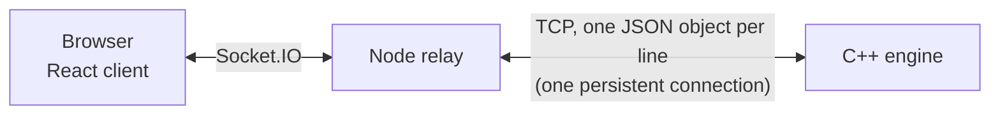

# Architecture

How the three services talk to each other, and why a move is fast.

- [Overview](#overview)
- [Life of a move](#life-of-a-move)
- [Relay ↔ engine protocol](#relay--engine-protocol)
- [Browser ↔ relay events](#browser--relay-events)
- [Design notes](#design-notes)

## Overview



| Service | Owns |
|---|---|
| **Browser** | Rendering, local highlighting, optimistic moves |
| **Relay** (`server/`) | Rooms, turns, the legal moves of the side to move, pushing events to both players |
| **Engine** (`cppServer/`) | The board, the rules, the final say on every move |

## Life of a move

```mermaid
sequenceDiagram
    participant W as White's browser
    participant R as Relay
    participant E as Engine
    participant B as Black's browser
    Note over W: highlights from legalMoves it already has<br/>and shows the move immediately
    W->>R: pieceMove (+ ack)
    R->>R: is it White's turn? is the target in White's legal moves?
    R->>E: update_position
    E-->>R: move applied, promotion if any,<br/>Black's check status + all legal moves
    R-->>W: ack { ok }
    R-->>B: serverPieceMove, serverPawnPromotion?, changeTurn,<br/>legalMoves, check / checkMate / staleMate?
    R-->>W: (same events)
    Note over B: can select a piece right away;<br/>no request needed
```

Network round trips per move, with an 80 ms browser↔relay round trip
(measured with the benchmark in the change that introduced this design):

| What the player waits for | Before | Now |
|---|---|---|
| Click a piece → legal squares highlighted | 1 round trip (83 ms) | none (0 ms) |
| Drop → your own piece moves | 1 round trip (84 ms) | none (0 ms), confirmed in the background |
| Drop → opponent sees it | 1 round trip (84 ms) | 1 round trip (82 ms), the physical minimum |
| Drop → check / mate shown | 2 round trips (169 ms) | 1 round trip (82 ms) |
| Drop → opponent sees a promoted queen | 3 round trips (249 ms) | 1 round trip (83 ms) |

Relay ↔ engine, same machine:

| | Before (HTTP, new connection per request) | Now (persistent connection) |
|---|---|---|
| One request | 0.8–1.1 ms | 0.1 ms |
| Back-to-back requests that failed | 50% with Node's default keep-alive agent | 0 |
| One full move incl. the opponent's legal moves | n/a (3–6 requests) | 0.2 ms (1 request) |

## Relay ↔ engine protocol

One TCP connection, opened by the relay at startup and kept open. Each
request is a single line of JSON; the engine answers every request with
exactly one line, in order. The relay adds a `seq` number that the engine
echoes back, so several requests can be in flight at once.

```
→ {"seq":12,"req_id":"update_position","room_id":"AB12C","player_id":"pl1","piece_id":"pawn5","position":{"x":4,"y":5}}
← {"seq":12,"res_id":"update_position","status":"SUCCESSFUL","old_position":{"x":2,"y":5},"position":{"x":4,"y":5},
   "captured_piece_id":"NIL","promoted_to":null,
   "turn_state":{"player_id":"pl2","check_or_mate_status":"NIL","legal_moves":{"pawn5":[{"x":6,"y":5},{"x":5,"y":5}], …}}}
```

Coordinates: `x` is the rank (1–8), `y` the file (1 = a). Piece ids are the
engine's (`pawn1`…`pawn8`, `rook1`, `knight2`, `queen`, `king`, …); a promoted
pawn keeps its pawn id.

| `req_id` | Does | Response extras |
|---|---|---|
| `create_room` | Fresh board (replaces a stale one with the same id) | `turn_state` for White |
| `delete_room` | Frees the board | |
| `update_position` | Checks legality itself, moves, captures, auto-promotes (`promotion`, default `queen`) | `old_position`, `promoted_to`, `captured_piece_id`, opponent's `turn_state` |
| `turn_state` | Check status + every legal move for `player_id` | `turn_state` |
| `undo_move` / `redo_move` | One level of undo/redo | same fields as before, plus `turn_state` |
| `reset` | New board in the same room | `turn_state` for White |
| `resign` | Acknowledges a resignation | |
| `valid_moves`, `check_or_mate`, `pawn_promotion` | Kept for compatibility (the dev tools use `valid_moves`) | |
| `ping` | Health check | |

Anything invalid (unknown room, player or piece, a captured piece, an
illegal target, malformed JSON) gets a response with a `status` other than
`SUCCESSFUL` and an `error` message, and never changes the board.

To poke the engine by hand:

```sh
printf '%s\n' '{"req_id":"create_room","room_id":"T"}' '{"req_id":"valid_moves","room_id":"T","player_id":"pl1","piece_id":"knight1"}' | nc -w1 localhost 5050
```

## Browser ↔ relay events

| Direction | Event | Notes |
|---|---|---|
| → relay | `pieceMove(player, piece, from, to, options?, ack?)` | `options.promotion` picks the promotion piece; `ack({ ok, error? })` lets the browser roll back |
| → relay | `undo`, `redo`, `resign`, `reset`, `chatText` | |
| ← relay | `legalMoves(player, { piece: [{x,y}…] })` | Start of every turn |
| ← relay | `serverPieceMove`, `serverPawnPromotion`, `changeTurn` | With every move |
| ← relay | `check`, `checkMate`, `staleMate` | With the move that caused them |
| ← relay | `serverUndo`, `serverRedo`, `serverResign`, `serverReset`, `startGame` | |

`pieceFocus`, `checkOrMateStatus`, `pawnPromotion` and the
`…AlreadyPromotedPawnOf` events are still accepted from older browser bundles
but are no longer sent by the current client.

## Design notes

- **One request per move.** The engine already computes every legal move to
  detect mate and stalemate, so returning them with the move costs nothing
  extra and saves the browser from asking piece by piece.
- **Optimistic moves are safe** because the browser only moves a piece to a
  square from the engine's own legal-move list. If the relay still rejects it
  (for example the other tab undid a move at the same moment), the ack says
  so and the board rolls back.
- **One operation per room at a time.** The relay queues moves, undos and
  resets per room, so two quick clicks can't interleave against the engine,
  and clears the cached legal moves while a move is being applied so a
  double-submit is refused.
- **TCP_NODELAY on both ends.** Messages are tiny; without it, Nagle's
  algorithm can hold a response back for tens of milliseconds.
- **Reconnects.** If the engine restarts, the relay fails pending requests
  immediately and reconnects with backoff (100 ms up to 2 s). Games in
  progress are lost with the engine's memory, as before.
