# Architecture

How Chess is put together: what each service owns, how they talk, and what
happens, step by step, from the moment two players meet (in a private room or
through matchmaking) to the end of the game. Each topic builds on the ones before it.

1. [The big picture](#1-the-big-picture)
2. [A shared vocabulary](#2-a-shared-vocabulary)
3. [Where it runs](#3-where-it-runs)
4. [The browser client](#4-the-browser-client)
5. [The relay](#5-the-relay)
6. [The engine](#6-the-engine)
7. [The relay ↔ engine link](#7-the-relay--engine-link)
8. [Life of a game](#8-life-of-a-game)
9. [Seats, leaving and coming back](#9-seats-leaving-and-coming-back)
10. [Playing online: matchmaking](#10-playing-online-matchmaking)
11. [Life of a move](#11-life-of-a-move)
12. [Undo, redo, resign and reset](#12-undo-redo-resign-and-reset)
13. [Consistency and concurrency](#13-consistency-and-concurrency)
14. [Latency budget](#14-latency-budget)
15. [When things fail](#15-when-things-fail)
16. [Development-only paths](#16-development-only-paths)
17. [Configuration](#17-configuration)
18. [Limits and known gaps](#18-limits-and-known-gaps)
19. [Reference: events and requests](#19-reference-events-and-requests)

---

## 1. The big picture

Chess is three services that each own one job:

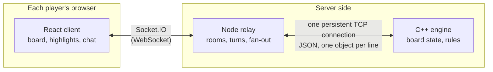

| Service | Folder | Owns | Doesn't own |
|---|---|---|---|
| **Client** | `client/` | Drawing the board, selecting and dragging pieces, highlighting legal squares, showing your move instantly, chat UI, timer | Whether a move is legal, whose turn it is |
| **Relay** | `server/` | Rooms and who is in them, whose turn it is, the current legal moves of the side to move, sending every update to both players | The rules of chess |
| **Engine** | `cppServer/` | The board of every room, the rules, legality of every move, check / checkmate / stalemate, promotion, undo/redo | Players, sockets, rooms beyond an id |

Two principles run through the design:

- **The engine is the single source of truth for the board.** The client
  draws what it is told; the relay never edits the board itself. A move is
  real only when the engine has applied it.
- **The server pushes; the browser doesn't ask.** After each move the relay
  sends both browsers everything they need for the next turn. Browsers never
  have to ask "where can this piece go?" or "am I in check?".

## 2. A shared vocabulary

All three services use the same names for things.

**Players.** `pl1` is White and always moves first. `pl2` is Black.

**Squares.** A square is a rank and a file, each 1–8. On the wire it's
`{ "x": rank, "y": file }`; in the client it's the two-digit string
`"<rank><file>"`.

| Algebraic | Wire | Client |
|---|---|---|
| a1 | `{x:1, y:1}` | `"11"` |
| e4 | `{x:4, y:5}` | `"45"` |
| h8 | `{x:8, y:8}` | `"88"` |

**Pieces.** Each side's pieces have fixed ids: `pawn1`…`pawn8` (by starting
file, a→h), `rook1`/`rook2` (a- and h-file), `knight1`/`knight2`,
`bishop1`/`bishop2` (c- and f-file), `queen`, `king`. A piece keeps its id all
game. **A promoted pawn keeps its pawn id** in the engine and relay
(`pawn3`); the client renders it as its new kind by prefixing the id:
`queen__pawn3`. The client always strips that prefix before sending an id to
the server.

**Rooms.** A room is identified by a code. A private room's code is short (5
characters, A–Z and 0–9) and generated by the browser that creates it; a
matchmade room's id is made by the relay (`M` + 8 hex characters). The same
id names the room in the relay and the board in the engine.

**Seats.** A room has two seats, `pl1` and `pl2`. The relay records which
socket sits in each, so it knows who left and which seat is free. A
matchmade room's seats are **reserved by tickets**: one-time random strings
only the two matched players are given.

**Browser id.** Each browser keeps a random id in `localStorage` and sends it
when it connects (`auth.clientId`). The relay uses it to count people rather
than tabs, and never to match a browser with itself.

**Profile.** What a player shows the other: `{ name, country }`, with the
country a two-letter code drawn as a flag.

## 3. Where it runs

Each service is a container. In production they sit behind a single public
entry point and are served under the sub-path `/chess/`.

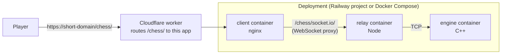

**nginx (client container)** does two things on one port:

- serves the built React app from `/chess/`, falling back to `index.html` so
  client-side routes work;
- proxies `/chess/socket.io/` (including the WebSocket upgrade) to the relay.

So browsers only ever talk to one origin, and only the client container needs
to be reachable from outside. `/healthz` is answered by nginx itself, at the
root, for the platform's health checks.

**The mount path.** The app lives under `/chess/` because the Cloudflare
worker hosts several projects on one domain and forwards paths unchanged.
One build argument, `APP_BASE` (default `/chess`), sets it everywhere:

- the asset URLs and router base in the Vite build;
- the directory nginx serves from;
- the Socket.IO path. The browser connects to `/chess/socket.io/`, and the
  relay must be started with `SOCKET_IO_PATH=/chess/socket.io/`.

**Locally** (`make run`) there's no nginx. Vite serves the client on port
5173, the browser connects straight to the relay on port 3000, and the engine
listens on 5050.

## 4. The browser client

### Structure

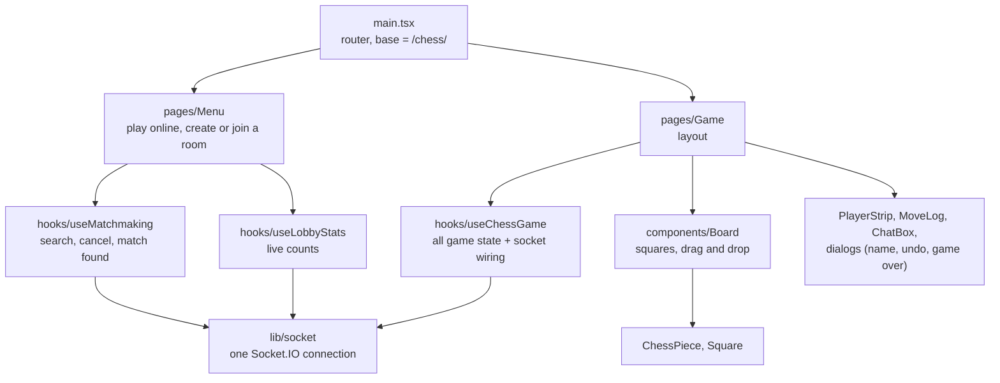

- **`Menu`** has three ways in: **Play online** (matchmaking, see
  [section 10](#10-playing-online-matchmaking)), **create** a private room
  (random code, colour choice) or **join** one by code. It also shows live
  player counts and your player card (name and flag). Where to go is written
  to `sessionStorage` by `lib/session` (room, seat, creator flag, and for a
  matched game its ticket), so each tab is its own player and a reload lands
  back in the same game.
- **`useChessGame`** is the only place with game logic in the browser. It
  holds the state, listens to every socket event, and exposes actions
  (`selectPiece`, `moveTo`, `requestUndo`, …) to the components. Components
  only render what it returns.
- **`lib/socket`** creates one Socket.IO connection for the app. Without
  `VITE_SERVER_URL` it connects to the page's own origin under the mount path,
  which is what nginx expects.

### State

| State | Meaning |
|---|---|
| `pieces` | Every piece on the board: `{ color: "W"\|"B", id, square }` |
| `currentTurn` | `pl1` or `pl2` |
| `legal moves` (ref) | The legal moves of the side to move, as last pushed by the relay, keyed by engine piece id |
| `pending move` (ref) | A move shown before the relay confirmed it, with what's needed to undo it on screen |
| `selectedKey`, `highlightMoves`, `highlightCaptures` | The selected piece and the squares lit up for it |
| `recentMove`, `checkedPlayer` | Last move's from/to squares; whose king is in check |
| `moveRows` | The move log, one row per full move |
| `messages`, `result`, timer | Chat, how the game ended (`{ kind, winner }`), the clock (set from the relay's clock on resume) |
| `started`, `profiles`, `presence` | Whether the board is set up; both players' name and flag; who is seated and whether the game is paused |
| `undoState`, `undoEvent` | Undos used per player, a pending request, and the last outcome |

The board is drawn from your side: White sees rank 1 at the bottom, Black
sees rank 8. Pieces can be clicked (select, then click a square) or dragged.
The board is sized in pixels from the space left, so it's always square;
moves and chat sit in a fixed-width column beside it (or below it on narrow
screens) and each can be collapsed.

### What the client decides on its own

- **Highlighting.** Selecting a piece looks up its moves in the pushed legal
  moves; there's no request. Squares holding an opponent's piece are shown as
  captures.
- **Showing your move.** If the target is in the legal list, the piece moves
  on screen immediately and a sound plays. The client then sends the move and
  waits for the relay's acknowledgement. If the move is refused, or no answer
  comes within 8 s, the board is put back exactly as it was.
- **The move log.** Your own move's notation is computed when you make it;
  the opponent's when it arrives.

Everything else (turn changes, check, promotion, game over) comes from the
relay.

## 5. The relay

### Structure

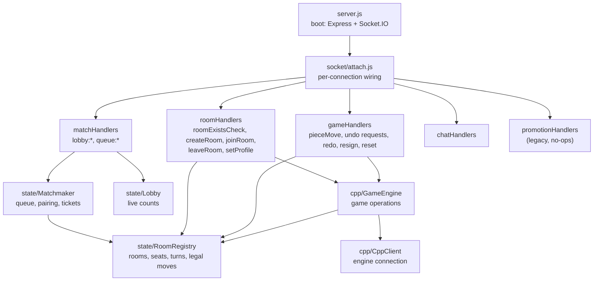

- **`server.js`** reads configuration once, starts Express (for `/healthz`
  and `/stats`) and Socket.IO on the same port, creates the long-lived
  objects, and shuts down cleanly on `SIGTERM`.
- **Socket handlers** validate what a browser sends and turn it into calls
  on `GameEngine`. They hold no state of their own.
- **`RoomRegistry`** is the relay's memory. For each socket it records which
  room it's in; for each room it records:
  - which socket sits in each seat, and each player's profile;
  - whose turn it is, and the legal moves of the side to move, by piece;
  - which pawns have been promoted;
  - the moves played (to rebuild the position for someone taking a seat
    mid-game, `state/snapshot`) and the game clock;
  - whether the game is paused, over (and how), and any undo request or
    abandonment countdown in progress;
  - for a matchmade room, the two seat tickets.
- **`GameEngine`** turns game operations into engine requests and engine
  replies into room events.
- **`CppClient`** owns the connection to the engine
  (see [section 7](#7-the-relay--engine-link)).
- **`Matchmaker`** and **`Lobby`** handle playing online and the live counts
  (see [section 10](#10-playing-online-matchmaking)).

### Room lifecycle

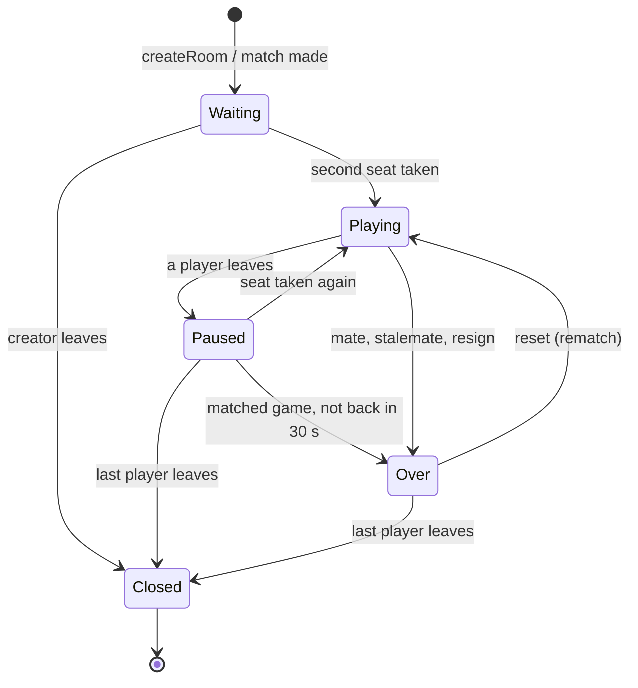

*Waiting* has one player; the second seat being taken starts the game, which
is when the engine creates the board. Moves, undo and redo all happen while
*Playing*. *Paused* means a seat is empty mid-game: nobody can move and the
clock is stopped (see [section 9](#9-seats-leaving-and-coming-back)). *Over*
is reached by checkmate, stalemate, resignation or, in a matched game,
abandonment; a reset (rematch) starts a fresh board in the same room.
*Closed* means the relay has forgotten the room and the engine has deleted
its board.

A room holds at most two seated sockets. `roomExistsCheck` lets the menu ask,
before joining, whether a private room has a free seat and which one; it
always says no for a matchmade room. When the last socket leaves, the relay
forgets the room and tells the engine to delete its board.

### How the relay checks a move

Before anything reaches the engine, `pieceMove` must pass:

1. the socket is in a room that exists, and the game isn't paused;
2. it is the named player's turn;
3. the target square is a well-formed position;
4. the target is in that piece's legal moves for this turn, as cached from the
   engine.

Moves that fail are acknowledged with `{ ok: false, error }` and never reach
the engine. The engine then checks the move again itself
(see [section 6](#6-the-engine)).

## 6. The engine

### Structure

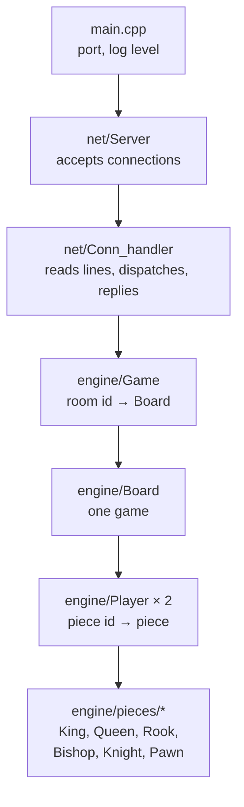

The engine is one process on **one thread** (a single Asio event loop). It
handles one request at a time, start to finish, so game state never needs
locks.

### How a board is represented

Each `Board` keeps the position two ways, kept in step on every change:

- **`board_map`**: square → (owner, piece). Answers "what's on e4?"
- **`piece_map`** (one per player): piece id → piece object, which knows its
  square and whether it's alive. Answers "where is White's `knight2`?"

A piece object knows how it moves (`get_possible_moves`) given the board.

### Legal moves, check and mate

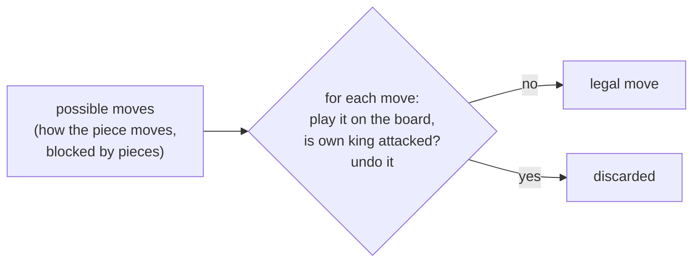

- **Possible moves** follow the piece's movement rules and stop at blocking
  pieces.
- **Legal moves** are the possible moves that don't leave your own king
  attacked. The engine tries each one on the board, checks, and takes it back.
- **Check**: an opponent piece attacks the king.
- **Checkmate**: in check with no legal move.
- **Stalemate**: not in check, with no legal move.

**Turn state.** One call, `turn_state(player)`, computes all of this together:
every legal move of every live piece, and whether the player is in check,
checkmated or stalemated. Mate detection already needs every legal move, so
handing them to the relay costs nothing extra. It's included in the reply to
every operation that changes the position.

### Promotion

When a pawn reaches the last rank, the engine promotes it as part of the same
move: to a queen, or to the piece named in the request's `promotion` field.
The piece keeps its pawn id, is marked as promoted, and is replaced in the
player's `piece_map` by the new kind.

### Undo and redo

The board remembers **one** move: where it came from, where it went, what it
captured and whether it promoted. Only the player who made that move can undo
it. Undo puts the piece back, revives anything it captured and turns a
promoted piece back into a pawn. Redo replays it. Making a new move clears
the redo.

### Validation

Every request is checked before it touches a board:

- the room exists;
- the player is `pl1` or `pl2`;
- the piece exists and is alive;
- squares are within 1–8;
- for a move, the target is one of the piece's legal moves;
- for a promotion, the piece is an unpromoted pawn on the last rank.

Anything that fails gets an error reply and changes nothing. The engine also
uses its own record of where a piece was, never the square a client claims.

## 7. The relay ↔ engine link

### What it is

The relay keeps **one TCP connection** open to the engine for its whole
lifetime. Each message is one line of JSON. Every request gets exactly one
reply line, and replies come back in the order the requests were sent.

```
→ {"seq":12,"req_id":"update_position","room_id":"AB12C","player_id":"pl1","piece_id":"pawn5","position":{"x":4,"y":5}}
← {"seq":12,"res_id":"update_position","status":"SUCCESSFUL",
   "old_position":{"x":2,"y":5},"position":{"x":4,"y":5},"captured_piece_id":"NIL","promoted_to":null,
   "turn_state":{"player_id":"pl2","check_or_mate_status":"NIL","legal_moves":{"pawn5":[{"x":6,"y":5},{"x":5,"y":5}],…}}}
```

The relay numbers each request (`seq`) and the engine echoes the number back,
so many requests can be outstanding on the one connection and each caller
gets its own answer.

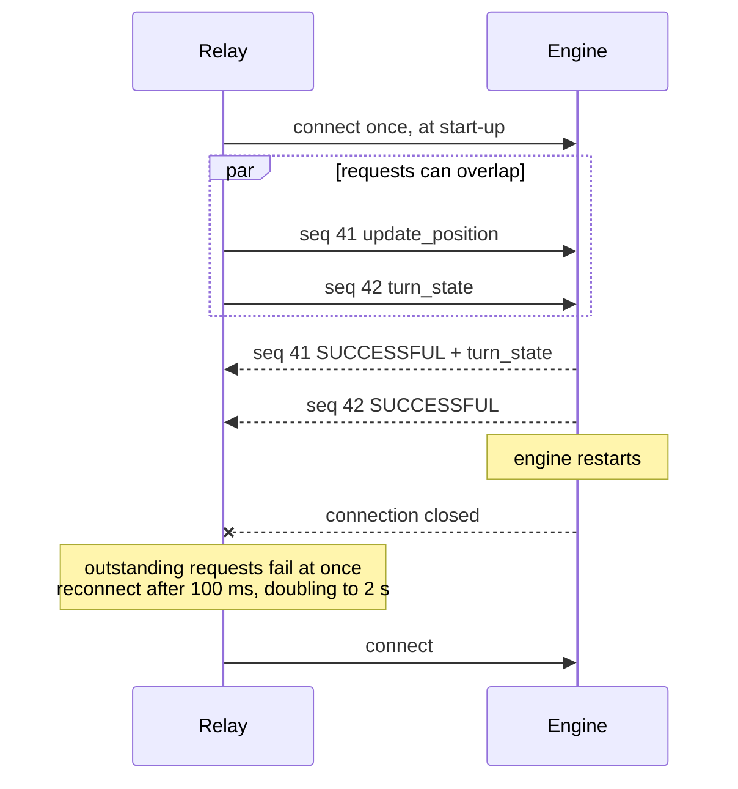

### Why it's built this way

It replaced an earlier design that sent each request as an HTTP `POST` on a
new TCP connection, which the engine closed after replying. That cost a
connection set-up per request and 3–6 requests per move. Worse, it was
unreliable:

- **Reused dying connections.** Node's HTTP client keeps connections open by
  default, but the engine closed them without saying so, so back-to-back
  requests often landed on a dying connection and were lost.
- **Partial reads.** The engine read each request in one 1024-byte read and
  could miss part of it.
- **Silent errors.** Errors produced no reply, so the relay waited out its
  timeout.

The persistent line-based link fixes all three:

| | Earlier: HTTP, new connection per request | Now: one persistent connection |
|---|---|---|
| Connection set-up | Every request | Once |
| Framing | Hand-parsed HTTP, one read of ≤ 1024 bytes | A newline ends a message (lines up to 64 KB) |
| Requests in flight | One per connection | Many, matched by `seq` |
| Errors | Often no reply | Always a reply with `status` and `error` |
| Requests per move | 3–6 | 1 |
| Time per request (same machine) | 0.8–1.1 ms | 0.1 ms |
| Back-to-back requests lost | Half, in testing | None |

One connection is enough because the engine is single-threaded: more
connections wouldn't let it do more at once. A newline is the simplest
possible framing and needs no extra library on either side. And you can still
talk to the engine by hand with `nc`.

### Details that matter

- **No-delay sockets.** Both ends disable Nagle's algorithm (`TCP_NODELAY`),
  so a small message is sent immediately instead of waiting to be batched
  with the next one.
- **Timeouts.** Each request has a timeout (`CPP_REQUEST_TIMEOUT_MS`, 5 s by
  default). Requests made while the relay is reconnecting wait for the
  connection, up to that timeout.
- **Failing fast.** When the connection drops, every outstanding request
  fails immediately instead of each one waiting for its own timeout.
- **Debugging by hand:**
  ```sh
  printf '%s\n' '{"req_id":"create_room","room_id":"T"}' \
                '{"req_id":"valid_moves","room_id":"T","player_id":"pl1","piece_id":"knight1"}' \
    | nc -w1 localhost 5050
  ```

## 8. Life of a game

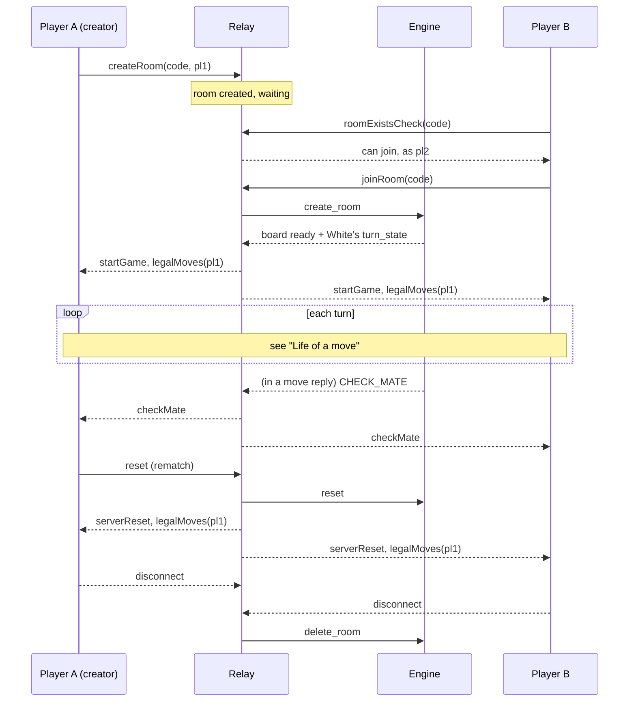

1. **Create.** The first player picks a colour; the browser generates a code
   and sends `createRoom`. The relay records the room and the creator's seat.
2. **Join.** The second player enters the code. `roomExistsCheck` confirms
   a seat is free and returns it; `joinRoom` puts the socket in that seat.
   Each player is asked for a name (pre-filled from last time) and their
   flag; `setProfile` stores it and the relay sends both profiles to the
   room as `serverProfiles`.
3. **Start.** The relay asks the engine to create the board. The reply
   carries White's legal moves, so both browsers get `startGame` and
   `legalMoves` together and White can move straight away.
4. **Play.** Turns alternate. Each move is one round trip
   (see [section 11](#11-life-of-a-move)).
5. **End.** A move reply reporting checkmate or stalemate becomes a
   `checkMate` / `staleMate` event; both browsers stop the clock and show the
   result. A player can also resign.
6. **Rematch.** `reset` gives the room a fresh board, with White to move.
7. **Leave.** One player leaving pauses the game
   ([section 9](#9-seats-leaving-and-coming-back)). When the last socket
   leaves, the relay forgets the room and the engine deletes the board.

## 9. Seats, leaving and coming back

The relay knows which socket is in which seat, so it can tell when a player
leaves and let someone else (or the same player) sit down again.

**Leaving.** Closing the tab, losing the connection, or leaving the game page
(the page sends `leaveRoom` as it unmounts) all empty the seat. If the game
had started and isn't over, the relay:

1. pauses it: moves, undo, resign and reset are refused, and the clock stops;
2. drops any pending undo request;
3. tells the other player with `serverPresence` (`{ seats, paused, left,
   elapsed }`).

The other player's board locks and shows that their opponent left. What
happens next depends on the room:

| Room | Then |
|---|---|
| **Private** | The game waits. The leaver's name is forgotten, and anyone who joins with the room code takes the empty seat. |
| **Matchmade** | Nobody else can join, so the game is decided: leaving on purpose (`leaveRoom`) is a resignation at once; a lost connection gets **30 seconds** (`ABANDON_GRACE_MS`) to come back, shown as a countdown to the other player, after which they win by abandonment (`serverAbandon`). |

**Coming back, or someone new.** Taking an empty seat in a started game
resumes it. The newcomer gets `serverSnapshot`, the whole position rebuilt
from the moves the relay recorded (`{ pieces, moveRows, recentMove, turn,
elapsed }`), then both players get `serverPresence` (no longer paused) and
the side to move gets its legal moves again. A new player starts with a full
set of undos; a returning matched player keeps their count. If the game had
already ended, a new player in a private room starts a fresh game instead,
and a matched player reloading a finished game is shown it as it ended.

Rebuilding the position from recorded moves works because every move the
engine allows is one piece from one square to another (there's no castling
or en passant yet). Those rules would need the record to note the second
piece that moves.

A reload is the same as leaving and coming back: the tab's `sessionStorage`
still names the room (and ticket), so it takes its seat again.

## 10. Playing online: matchmaking

**Play online** pairs you with the next person who also wants a game.

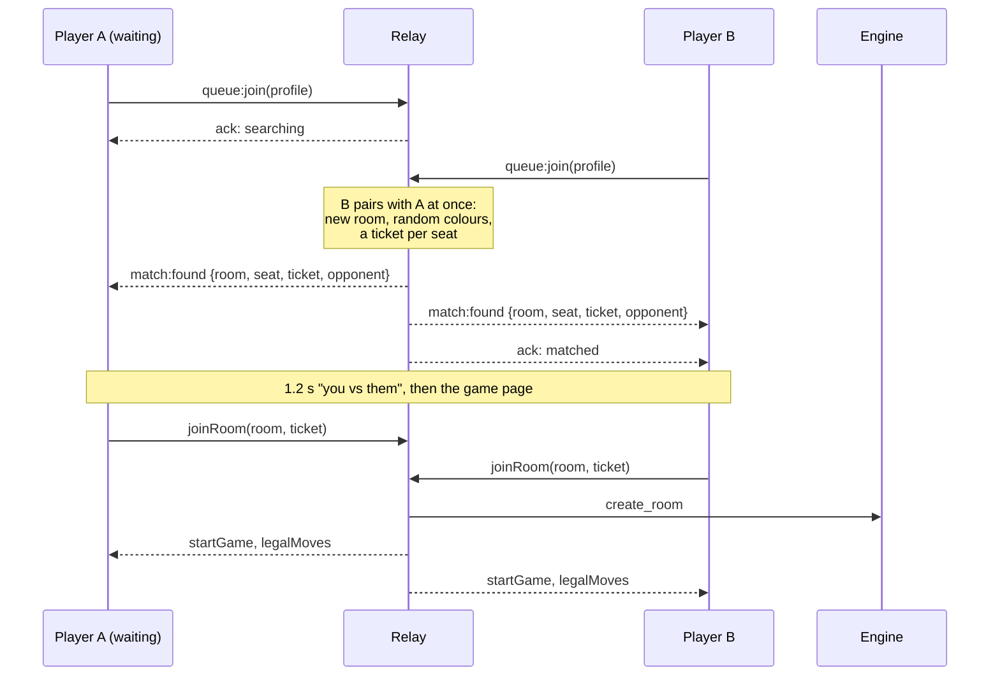

**The queue** (`state/Matchmaker`) is a `Map` keyed by socket id. A `Map`
keeps insertion order, so the first entry is whoever has waited longest, and
joining, leaving and taking the oldest are all constant time. There is no
matching loop: pairing happens inside `queue:join`, the moment a second
player arrives. Two tabs of the same browser are never paired. The pairing
rule is one function (`canPair`), the place to add ratings or time controls.

**Why tickets, not seating both players at once.** The game page only listens
for game events once it has loaded. If the relay seated both sockets and
started the game straight away, the first `startGame` and `legalMoves` could
arrive while the browser is still changing page, and be lost. Instead each
seat is reserved by a ticket; each browser opens the game page and calls
`joinRoom(room, ticket)`, exactly like joining a private room, and the game
starts when both are seated. If both aren't seated within 10 seconds
(`MATCH_CLAIM_TIMEOUT_MS`), the match is called off (`match:cancelled`):
whoever did show up goes back to the **front** of the queue, the other is
told it timed out.

**Searching** shows how long you've waited and how many others are
searching. Leaving the menu or disconnecting takes you out of the queue (a
reconnect while searching rejoins it). After a minute, the menu offers to
invite a friend to a private room instead. Joining the queue from inside a
room leaves that room first, which is how **Play again** after a matched game
works in one step.

**Live counts** (`state/Lobby`): `online` (distinct browsers, from the
browser ids), `searching` (the queue) and `playing` (seated players in
started games). Only sockets on the menu receive them: `lobby:subscribe`
answers with the current counts at once, then `lobby:stats` follows at most
every 1.5 s, and only when a number changed. `/stats` includes them too.

**Rate limits.** `queue:join`/`queue:leave`, `roomExistsCheck` and chat are
limited per socket (a sliding window, `socket/rateLimit.js`): generous for a
person, tight for a script guessing room codes or spamming the queue.

**Scaling out.** Everything above lives in one relay process. Running several
relays would need the queue, counts and rooms in a shared store (Redis, with
the Socket.IO Redis adapter); `Matchmaker`'s small interface (`join`, `leave`,
`seated`) is what would move.

## 11. Life of a move

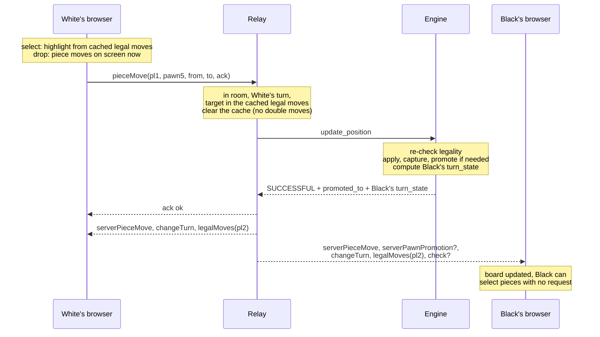

Step by step:

1. **Select.** White clicks a pawn. The browser looks up `pawn5` in the
   legal moves it received at the start of the turn and lights up the target
   squares. No request is sent.
2. **Drop.** White drops the pawn on a lit square. The browser moves it on
   screen, plays the sound and remembers how to undo that on screen. It then
   sends `pieceMove` with an acknowledgement callback.
3. **Relay checks** (see [section 5](#how-the-relay-checks-a-move)), then
   clears the room's cached legal moves, so a duplicate submission is
   refused.
4. **Engine applies.** One `update_position` request. The engine:
   - re-checks legality;
   - moves the piece and removes any captured one;
   - promotes a pawn on the last rank;
   - computes Black's turn state (check status plus every legal move).
5. **Relay fans out**, in this order:
   1. `serverPieceMove`;
   2. `serverPawnPromotion`, if a pawn was promoted;
   3. `changeTurn`;
   4. `legalMoves` for Black;
   5. `check`, `checkMate` or `staleMate`, if relevant.

   The relay also stores Black's legal moves for the next check, and
   acknowledges White's move.
6. **Browsers update.** White's browser recognises its own move and only adds
   it to the move log. Black's browser applies it, plays the sound, renames a
   promoted pawn (`pawn5` → `queen__pawn5`) and highlights a checked king.
   Black can now select pieces immediately.

If the relay or engine rejects the move, White gets `{ ok: false }` and the
board snaps back. No other event is sent, so Black never sees it.

## 12. Undo, redo, resign and reset

| Action | Who can | What happens |
|---|---|---|
| **Undo** | The player who made the last move, **if the opponent allows it**, at most **3 times a game** | `undoRequest` puts a request to the opponent (`serverUndoState` with `pending`), who answers with `undoRespond`; no answer in 15 s declines it, and the asker can `undoCancel`. On "allow", the engine reverses that one move: the piece goes back, a captured piece returns, a promoted piece becomes a pawn again. The relay sends `serverUndo`, then the mover's turn state, so it's their turn again. Only accepted undos count towards the 3. |
| **Redo** | The same player, right after an undo | The engine replays the move. The relay sends `serverRedo`, then the opponent's turn state. |
| **Resign** | Either player | The relay sends `serverResign` to both and clears the cached legal moves; both browsers show the result. |
| **Reset** | Either player | The engine replaces the board; the relay resets the turn to White and sends `serverReset` plus White's legal moves. Used for rematches. |

Each goes through the same per-room queue as moves
(see [section 13](#13-consistency-and-concurrency)).

## 13. Consistency and concurrency

Several rules keep both browsers, the relay and the engine in agreement:

- **One writer for the board.** Only the engine changes game state. The relay
  caches only what the engine told it (turn and legal moves), and replaces
  that cache with each reply.
- **One operation per room at a time.** The relay queues operations per room,
  so a move, an undo and a reset arriving together are applied one after
  another, never interleaved. Different rooms don't wait for each other in
  the relay. The engine is single-threaded, so it processes all requests one
  at a time anyway.
- **No double moves.** The cached legal moves are cleared the moment a move
  is accepted for sending, so a second submission in the same turn fails the
  legality check.
- **Ordered delivery.** Socket.IO delivers a room's events to each browser in
  the order they were sent. The relay always sends a move, then the turn
  change, then the new legal moves, then the check status.
- **Optimistic UI, reconciled.** Your browser shows your move before
  confirmation. Only legal moves (by the engine's own list) are shown early,
  so a rejection is rare: a race with an undo, or a lost connection. When it
  happens, the acknowledgement or its timeout puts the board back.

## 14. Latency budget

What a player waits for, with an 80 ms round trip between browser and server
(simulated), compared with the earlier request-driven design:

| What the player waits for | Earlier | Now | Why |
|---|---|---|---|
| Click a piece → squares lit | 83 ms | **0 ms** | Legal moves arrive with the previous move |
| Drop → your piece moves | 84 ms | **0 ms** | Shown immediately, confirmed in the background |
| Drop → opponent sees it | 84 ms | 82 ms | One trip is the physical minimum |
| Drop → check or mate shown | 169 ms | **82 ms** | Check status comes in the same reply as the move |
| Drop → opponent sees a promoted queen | 249 ms | **83 ms** | Promotion happens inside the move |

The server side of a move costs about **0.2 ms**: one engine request,
including computing the opponent's legal moves. Everything else is network.

## 15. When things fail

| Failure | What happens |
|---|---|
| **A browser disconnects** | Its seat empties and the game pauses ([section 9](#9-seats-leaving-and-coming-back)). Reloading the page takes the seat back. In a matched game the player has 30 s before losing by abandonment. If it was the last one in the room, the room and the engine's board are deleted. |
| **A matched player never opens the game** | After 10 s the match is called off; the other player goes back to the front of the queue. |
| **A move is refused** | The mover gets `{ ok: false, error }` and the board snaps back. The opponent sees nothing. |
| **The relay doesn't answer a move within 8 s** | The mover's board snaps back. If the move did go through, the `serverPieceMove` that follows puts it back on the board. |
| **The engine restarts** | Outstanding requests fail at once; the relay reconnects with backoff (100 ms to 2 s). Boards live in the engine's memory, so games in progress are lost; new games work as soon as the connection is back. |
| **The engine is unreachable** | Requests wait for the connection up to the request timeout (5 s), then fail. The relay keeps serving the menu and chat. |
| **The relay restarts** | All rooms are lost (they live in memory); browsers reconnect but need a new game. |
| **A malformed or invalid request reaches the engine** | It gets an error reply and nothing changes. The engine keeps running. |

There is no persistence: no database, and nothing survives a restart. That's
deliberate for casual games, and the main thing to add if games ever need to
survive deploys.

## 16. Development-only paths

Development builds add a few things that don't exist in production.

**Loading a position.** A relay started with `DEV_TOOLS=1` (and `NODE_ENV`
not `production`) accepts extra `dev:*` socket events. They load a game from
PGN, start a one-tab "solo" game, and save the current game to
`dev/games/`. A load:

1. resets the room's board in the engine;
2. replays each move through the same `valid_moves` and `update_position`
   requests a real move uses, so the position is exactly what playing those
   moves would produce;
3. sends both browsers a single `dev:state` snapshot;
4. follows it with the normal `changeTurn` and `legalMoves`.

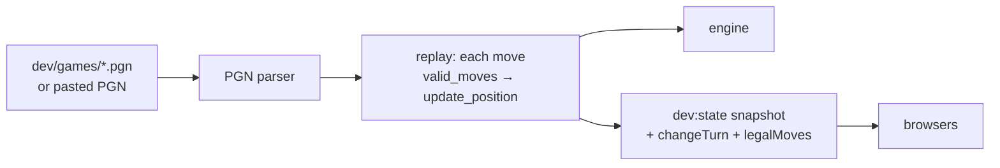

**Play both sides.** In dev builds a single tab can move for whichever side
is to play. The client acts as the player whose turn it is.

**How it's kept out of production:**

- the relay only loads the dev module when `DEV_TOOLS=1` and `NODE_ENV` isn't
  `production`, and `server/.dockerignore` leaves it out of the image;
- the client's `src/dev/` code is only reached through `import.meta.env.DEV`
  branches, which Vite removes from production builds;
- `dev/games/` is outside every Docker build.

## 17. Configuration

| Service | Variable | Default | Purpose |
|---|---|---|---|
| Engine | `PORT` / `CHESS_ENGINE_PORT` | 5000 | Listen port (`PORT` wins; set by Railway) |
| Engine | `CHESS_LOG_LEVEL` | `INFO` | `TRACE` … `FATAL` |
| Relay | `PORT` / `NODE_PORT` | 3000 | Listen port |
| Relay | `NODE_HOST` | `0.0.0.0` | Bind address |
| Relay | `CPP_HOST`, `CPP_PORT` | `localhost`, 5000 | Where the engine is |
| Relay | `CPP_REQUEST_TIMEOUT_MS` | 5000 | Per-request engine timeout |
| Relay | `SOCKET_IO_PATH` | `/socket.io/` | Must match the browser's path (`/chess/socket.io/` behind nginx) |
| Relay | `ALLOWED_ORIGINS` | `*` | CORS for the Express routes |
| Relay | `LOG_LEVEL` | `INFO` | Log level |
| Relay | `DEV_TOOLS`, `DEV_GAMES_DIR` | off, `dev/games` | Development tools (see [section 16](#16-development-only-paths)) |
| Client (build) | `APP_BASE` → `BASE_PATH` | `/chess` | Mount path |
| Client (build) | `VITE_SERVER_URL` | empty (same origin) | Connect straight to a relay instead of the page's origin |
| Client (build) | `VITE_SOCKET_PATH` | derived | Override the Socket.IO path |
| Client (build) | `VITE_LOG_LEVEL` | `INFO` | Browser log level (overridable with `localStorage.LOG_LEVEL`) |
| nginx | `PORT`, `APP_BASE`, `NODE_HOST`, `NODE_PORT` | 80, `/chess`, `node-server`, 3000 | Listen port, mount path, where the relay is |

`make run` uses 5050 for the engine locally, because macOS reserves 5000 for
AirPlay.

Game-rule timings are constants in `server/src/constants.js`, not
environment variables: `MAX_UNDOS` (3), `UNDO_REQUEST_TIMEOUT_MS` (15 s),
`MATCH_CLAIM_TIMEOUT_MS` (10 s), `ABANDON_GRACE_MS` (30 s),
`LOBBY_STATS_INTERVAL_MS` (1.5 s), `MAX_NAME_LENGTH` (16).

## 18. Limits and known gaps

- **Missing rules.** No castling and no en passant. Threefold repetition and
  the fifty-move rule aren't detected.
- **One level of undo.** Only the last move can be undone, only by the
  player who made it, with the opponent's approval, three times a game.
- **No persistence.** Rooms and boards live in memory; restarts end games.
- **One engine instance.** Every room's board is in one process. A move
  costs about 0.2 ms of engine time, which leaves plenty of headroom. To scale
  out, run several engines and give the relay one connection per engine, with
  each room pinned to one engine (for example by hashing the room code).
- **One relay process.** The matchmaking queue, live counts and rooms are in
  one process's memory (see [section 10](#10-playing-online-matchmaking)).
- **No accounts or ratings.** A player is a browser id and a chosen name;
  matchmaking is first come, first served.
- **Moves are checked against the seat named, not the socket.** The relay
  knows which socket sits where, but a move is accepted for whichever
  player's turn it is. Development's "play both sides" relies on this.

## 19. Reference: events and requests

### Browser → relay

| Event | Arguments | Notes |
|---|---|---|
| `roomExistsCheck` | `code, callback(canJoin, seat)` | Before joining; always no for a matchmade room |
| `createRoom` | `code, seat` | Also takes the creator's seat back after a reload |
| `joinRoom` | `code, ticket?` | Takes the free seat (the ticket's seat in a matchmade room); starts or resumes the game |
| `leaveRoom` | | Leaving the game page |
| `setProfile` | `player, { name, country }` | Name clipped to 16 characters |
| `lobby:subscribe` | `callback({ ok, stats })` | Menu wants live counts; `lobby:unsubscribe` stops them |
| `queue:join` | `profile, callback({ ok, status \| error })` | `status`: `searching` or `matched` |
| `queue:leave` | `callback?` | Stop searching |
| `undoRequest`, `undoCancel` | `player` | Ask to take back your last move / withdraw the request |
| `undoRespond` | `player, accept` | Answer the opponent's request |
| `pieceMove` | `player, pieceId, from, to, options?, ack?` | `options.promotion` picks the promotion piece; `ack({ ok, error? })` |
| `redo`, `resign`, `reset` | `player` | |
| `undo` | `player` | Immediate undo; development tools only (`DEV_TOOLS=1`) |
| `chatText` | `player, text` | Clipped to 500 characters |
| `pieceFocus`, `checkOrMateStatus`, `pawnPromotion`, `…AlreadyPromotedPawnOf` | | Legacy; still answered for older browser bundles |

### Relay → browser

| Event | Arguments | When |
|---|---|---|
| `startGame` | | Second player joined |
| `legalMoves` | `player, { pieceId: [{x,y}…] }` | Start of every turn |
| `serverPieceMove` | `player, pieceId, from, to` | Every move |
| `serverPawnPromotion` | `player, pieceId, square, newKind` | With a promoting move |
| `changeTurn` | `player` | Turn passes |
| `check`, `checkMate`, `staleMate` | `player` (the side to move) | With the move that caused it |
| `serverUndo` | `player, pieceId, square, demoted, revivedPlayer, revivedPiece, revivedSquare` | |
| `serverRedo` | `player, pieceId, square, promoted, capturedPlayer, capturedPiece, capturedSquare` | |
| `serverResign`, `serverReset` | `player` | |
| `serverChatText` | `player, text` | |
| `serverProfiles` | `{ pl1, pl2 }` (each a profile or null) | A player joins, leaves or names themselves |
| `serverPresence` | `{ seats, paused, left, elapsed, abandonIn }` | A seat empties or fills |
| `serverSnapshot` | `{ pieces, moveRows, recentMove, turn, elapsed, result? }` | You took a seat in a game already under way |
| `serverUndoState` | `{ max, used, pending }, event?` | Undo requested, answered, withdrawn, expired, or counts reset |
| `serverAbandon` | `winner` | Matched game: the other player didn't come back in time |
| `lobby:stats` | `{ online, searching, playing }` | To the menu, when the counts change |
| `match:found` | `{ roomId, playerId, ticket, opponent }` | You've been paired |
| `match:cancelled` | `{ reason, requeued }` | The other player didn't take their seat in time |

### Relay → engine

| `req_id` | Does | Reply includes |
|---|---|---|
| `create_room` | Fresh board (replaces a stale one with the same id) | White's `turn_state` |
| `delete_room` | Frees the board | |
| `update_position` | Re-checks legality, moves, captures, promotes (`promotion`, default queen) | `old_position`, `position`, `captured_piece_id`, `promoted_to`, opponent's `turn_state` |
| `turn_state` | Check status and every legal move for `player_id` | `turn_state` |
| `undo_move`, `redo_move` | One level of undo / redo | The undone or redone move, and the next player's `turn_state` |
| `reset` | New board in the same room | White's `turn_state` |
| `resign` | Acknowledges a resignation | |
| `valid_moves` | Legal moves of one piece (used by the development replay) | `position_array` |
| `check_or_mate`, `pawn_promotion` | Kept for compatibility | |
| `ping` | Liveness check | |

Every reply has `status`: `SUCCESSFUL`, or an error such as `BAD_REQUEST`,
`ROOM_DOES_NOT_EXIST`, `INVALID_PIECE`, `ILLEGAL_MOVE`, `INVALID_PROMOTION`
or `UNKNOWN_REQUEST`. Errors also carry an `error` message.
