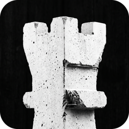
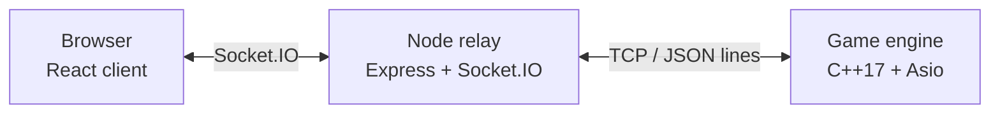

<h1>
  
  &nbsp;Chess
</h1>

<p>
  <strong>Real-time, two-player online chess. Create a room, share the code, play.</strong>
</p>

<p>
  
  
  
  
  
  
</p>

---

## About

Chess is a browser game for two people in different places. Press **Play
online** to be paired with the next person looking for a game, or create a
private room and send a friend its short code. No sign-up, no accounts.

Every move is checked by a dedicated chess engine written in C++, so the
rules are enforced on the server rather than trusted to the browser.

## Features

- **Play online.** Instant matchmaking with whoever is searching, with live
  counts of players online, searching and playing.
- **Private rooms.** Share a code with a friend and you're playing.
- **Names and flags.** Each player picks a name; the flag comes from your
  country (or one you choose).
- **Full rules.** Check, checkmate, stalemate and pawn promotion are all
  handled by the engine.
- **Move history.** A running move log.
- **Undo with permission.** Ask your opponent to take back a move, up to
  three times a game.
- **Leave and come back.** If a player leaves, the game pauses; reloading
  takes your seat back. In private rooms someone new can take over the seat;
  in online games the other player wins if you're gone for 30 seconds.
- **In-game chat.** Talk to your opponent while you play.
- **Resign or reset.** End a game or start a fresh one without leaving the room.
- **Themes and sound.** Pick a board theme; moves and captures have audio cues.
- **Works on phones.** The board stays square, and the move list and chat
  fold away.
- **Drag or click to move**, with highlighted legal squares.

## How it works



| Part | Folder | Role |
|---|---|---|
| **Client** | [`client/`](client) | React, TypeScript and Tailwind UI: the board, chat and room screens. |
| **Relay** | [`server/`](server) | Node + Socket.IO. Keeps rooms and connects players to the engine. |
| **Engine** | [`cppServer/`](cppServer) | Holds game state and validates every move. |

## Quick start

You'll need Node 20+, CMake, a C++17 compiler and [Conan 2](https://conan.io).

```sh
make build   # one-time: installs dependencies and builds the engine
make run     # starts all three services
```

Then open **http://localhost:5173/chess/** in two browser tabs, create a room
in one and join it from the other.

## Documentation

| Guide | What's inside |
|---|---|
| [Development](docs/development.md) | Local setup, running services individually, Conan, environment variables, troubleshooting |
| [Deployment](docs/deployment.md) | Docker Compose on a VM, Railway, and serving the app under a sub-path |
| [Architecture](docs/architecture.md) | How the services fit together, the life of a game and a move, the engine protocol, failure handling |
| [Contributing](.github/CONTRIBUTING.md) | How to report bugs, propose changes and open a pull request |

## Contributing

Bug reports, ideas and pull requests are welcome. Start with the
[contributing guide](.github/CONTRIBUTING.md), and please follow the
[code of conduct](.github/CODE_OF_CONDUCT.md).

## Author

Made by [Shabbir Jamal](https://shabbirjamal.com).
